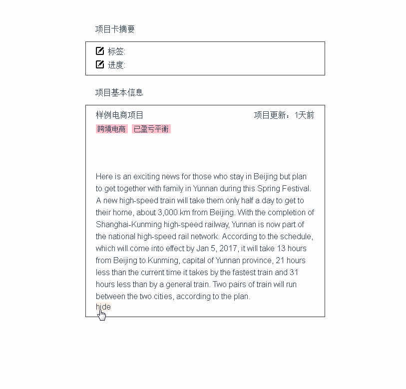

# vue-text-dot
A vue component for clipping text.

## Installation
``` bash
npm install vue-text-dot --save
```
and in your component:

``` javascript
import dot from 'vue-text-dot'
```

## Usage

``` html
<dot :msg="someText" @isDot="methods when is Doted"></dot>
```

## Props
| Name | Type | Required | Default | Description |
| ---:| --- | --- | --- | --- |
| msg | String | true | |text in dot |
| line | Number | false | 1 | the number of rows that you want to show |

## Tips
 You'd better set the class for component including 'line-height'

## Demo
<p align="center">
  
</p>

``` html
<template>
  <div>
    <dot v-if="dot" :msg="desc" :line="2" class="desc" @isDot="isDot"></dot>
    <p v-if="!dot" class="desc">{{pinfo.desc}}</p>
    <span v-if="moreText && dot" @click="dot = !dot" class="show-more">show more</span>
    <span v-if="!dot" @click="dot = !dot" class="show-more">hide</span>
  </div>
</template>
```
``` javascript
import dot from 'vue-text-dot'
...
 {
   ...
   components: { dot, ... },
   data () {
     return {
       desc: '.....text....'
       moreText: false,
       dot: true
     }
   },
   methods: {
     // $emit
     isDot () {
       this.moreText = true
     }
   }
 }
...
```
